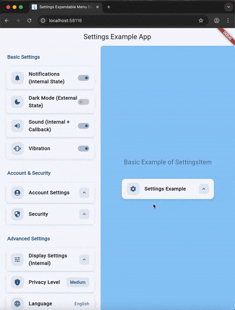

# Settings Expandable Menu - Example App

This example app demonstrates all the features of the `settings_item` package.

## Features Demonstrated

### 1. **Switch Mode**
- Notifications toggle
- Dark mode toggle
- Sound toggle
- Vibration toggle

### 2. **Expandable Mode**
- Account Settings with expandable menu items
- Security settings with nested options
- Privacy level selector with radio buttons
- Language selector with multiple options

### 3. **Button Mode**
- About page navigation
- Help & Support navigation

### 4. **Advanced Features**
- Custom suffix widgets (privacy level badge, language text)
- Expansion callbacks
- Material Design 3 theming
- Dark mode support
- Interactive feedback with bounce animations

## Running the Example

```bash
cd example
flutter pub get
flutter run
```

## Screenshots



## Code Structure

- `main.dart` - Complete example demonstrating all features
- Organized sections showing different use cases
- Clean, documented code for easy understanding

## Learn More

See the main [README.md](../README.md) for detailed documentation and API reference.
